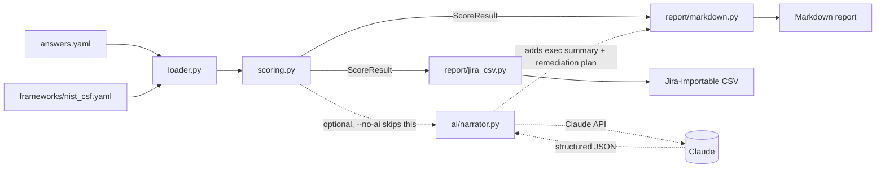

# Architecture

RiskLens is deliberately split into a deterministic core and an optional AI layer, so the tool is fully usable, testable, and free to run without ever calling an external API.

## Why it's split this way

- **`scoring.py` is pure**: no I/O, no network calls, no randomness. Given the same framework and answers, it always produces the same `ScoreResult`. That's what makes it fully unit-testable and defensible in an interview: you can walk through the weighting math on a whiteboard.
- **`ai/narrator.py` only narrates, never scores.** It receives the already-computed `ScoreResult` as structured JSON and is explicitly instructed not to recompute scores or invent findings. The AI layer can be swapped, removed, or mocked without touching the scoring logic at all.
- **The CLI (`cli.py`) is the only place these pieces are wired together.** `--no-ai` skips the network call entirely, which is what the test suite and CI use. RiskLens's own tests never spend a cent or depend on network access.

## Data flow

1. `loader.py` parses the NIST CSF framework definition and a filled-out answers file into the dataclasses in `models.py`.
2. `scoring.py` computes a weighted score per question → category → function → overall, flags findings below a threshold, and ranks them by `weight × (4 − score)`.
3. `report/markdown.py` renders the deterministic result. If AI narration was requested, `ai/narrator.py` is called with the structured findings and its output is merged into the same report.
4. `report/jira_csv.py` optionally exports the prioritized findings as a Jira-importable backlog.
